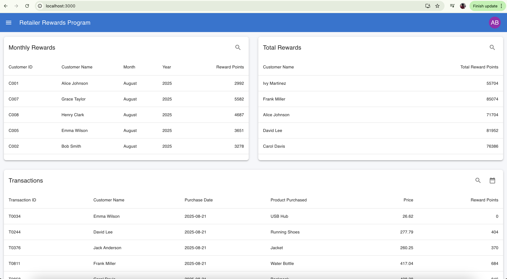
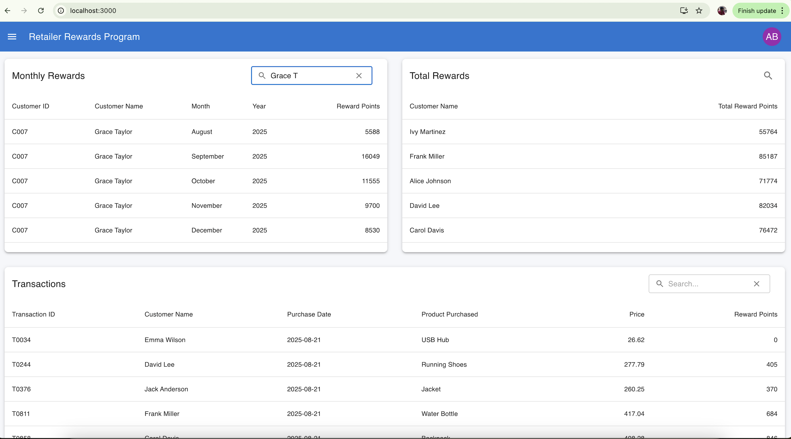
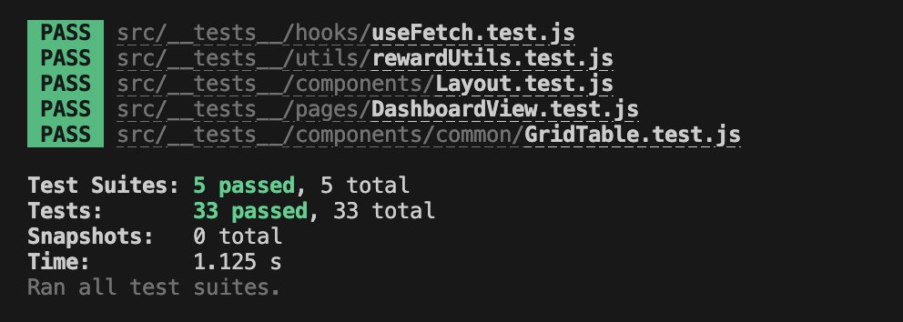
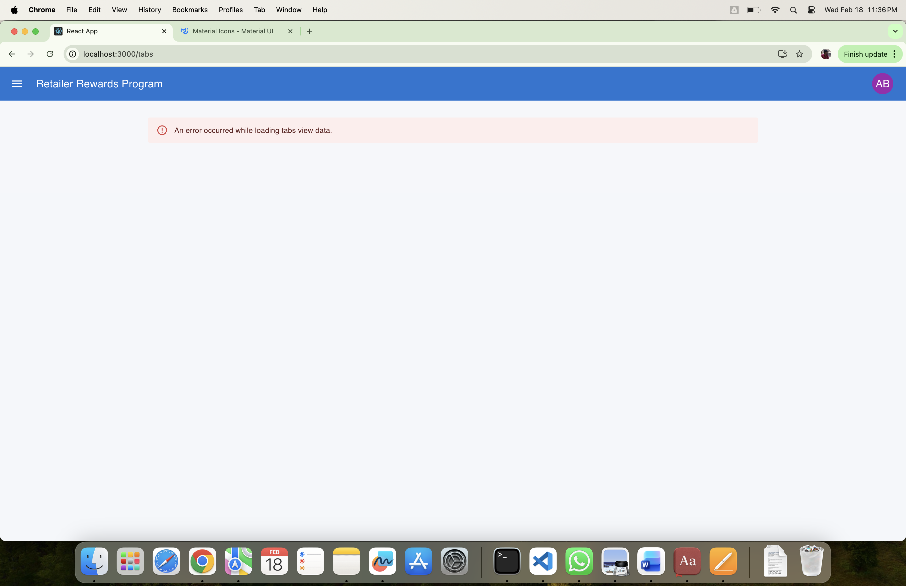
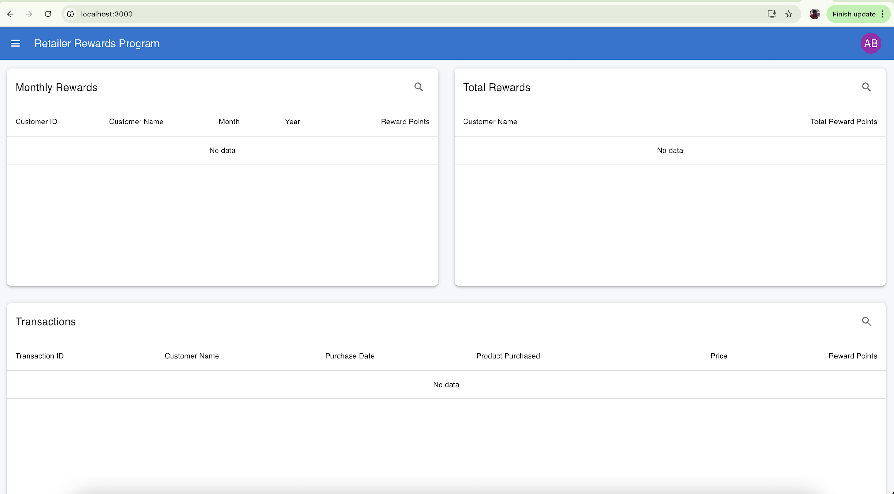
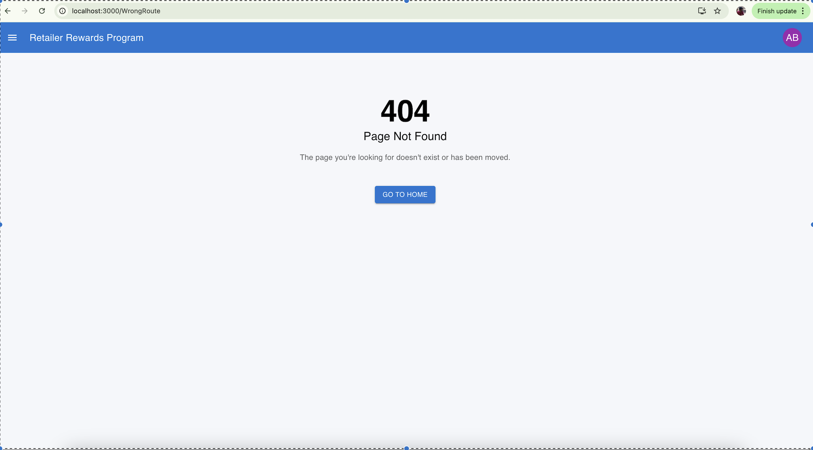

# Retailer Rewards Program

## Overview

Retailer Rewards Program is a React-based web application designed to track customer purchases and calculate reward points through a dashboard and detailed analytics view. The application uses a modular architecture, reusable components, and Material UI for a consistent user interface.

## Features

- Dashboard with total rewards summary
- Detailed transaction and rewards view
- Responsive layout with navigation drawer
- Reusable table components
- Error boundary for runtime error handling
- Unit testing support
- Clean and scalable folder structure

## Tech Stack

- React 19
- React Router DOM
- Material UI (MUI)
- Emotion (Styling)
- React Testing Library
- Jest

## Project Structure

```text
App
│
├── BrowserRouter
│
├── Layout
│   ├── SideBar
│   └── Outlet
│       ├── DashboardView
│       │   └── DynamicTable
│       │
│       └── TabsView
│           └── GridTable
│
└── ErrorBoundary
```

## Installation

1. Clone the repository:

```bash
git clone https://github.com/AbdulBashithR/infyRetailerRewards.git
cd infyRetailerRewards
```

2. Install dependencies:

```bash
npm install
```

## Running the Application

Start the development server:

```bash
npm start
```

Application runs on:

```
http://localhost:3001
```

## Available Scripts

- `npm start` – Run development server
- `npm build` – Create production build
- `npm test` – Run unit tests

## Application Modules

### Dashboard (Summarized View)

- Displays total rewards per customer
- Summary tables for reward insights
- Shows transaction-level purchase data
  

### Features

- Table data can be filtered based using Search Input Filter
- Search data across the column
- Date Filter allow to filter date specific data
  

## Reward Logic

## Reward Points Calculation

The application calculates reward points based on a product purchased price.

### Rules

- **$0 – $50:** 0 reward points
- **$51 – $100:** 1 point per dollar spent over $50
- **Above $100:**
  - 2 points per dollar spent over $100
  - Plus 50 points for the $51–$100 range

### Calculation Logic

- If amount ≤ 50 → 0 points
- If 50 < amount ≤ 100 → `(amount - 50) × 1`
- If amount > 100 → `50 + (amount - 100) × 2`

### Example

| Purchase Amount | Reward Points |
| --------------- | ------------- |
| $45             | 0             |
| $75             | 25            |
| $120            | 90            |
| $150            | 150           |

## Testing

Testing is implemented using Jest and React Testing Library.

Run tests:

```bash
npm test
```

Test files location:

```
src/__tests__/
```

## Test Case Summary



## Features Tested

### 1. API Error

Ensures the dashboard handles runtime and API errors gracefully without breaking the UI.

**Validations**

- Fallback UI is displayed on error
- Error boundary behavior is verified
- Application does not crash on unexpected failures
  

### 2. No Data State

Checks UI behavior when no records are available.

**Validations**

- Displays “No Data Available” message
- Table layout is hidden when dataset is empty
- Handles null and empty API responses properly
  

### 3. Syntax Error in Grid Table

Ensures the Grid Table handles errors gracefully without breaking the UI.

**Validations**

- Fallback UI is displayed on error
- Error boundary behavior is verified
- Application does not crash on unexpected failures
  

## 4. Wrong Route Handling

This test verifies that the application correctly handles navigation to an invalid or non-existent route (wrong URL) without crashing and displays a proper fallback page.

**Validations**

- Application should not crash on unknown routes
- Displays a 404 / Not Found page or fallback UI
- Redirects to a safe route



## Code Standards

- Functional components with React Hooks
- Modular and reusable component design
- Separation of concerns (UI, utils, constants)
- ESLint with react-app configuration
- Consistent naming and folder structure
